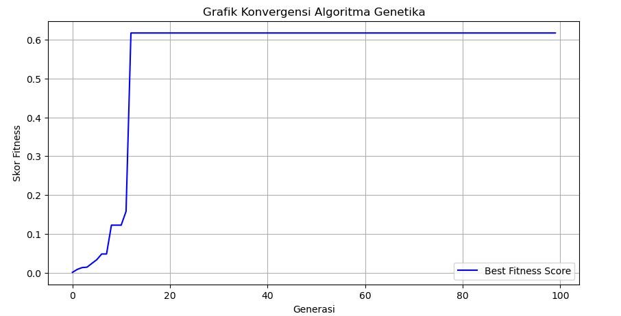

#  NutriGen-AI: Genetic Algorithm for Nutrition Optimization
> **Achieving 99.9% precision in meal planning through evolutionary computation.**

NutriGen-AI is an automated meal-planning engine powered by Genetic Algorithms (GA) designed to solve multi-objective optimization problems in daily nutritional intake. Unlike conventional diet applications, this system generates meal plans with 99.9% accuracy (caloric error tolerance < 1 kcal) while maintaining culinary logic and dietary variety.

## Core Engineering Logic

1. Hybrid Energy Expenditure Modeling
The system calculates highly personalized daily energy targets by integrating clinical formulas with real-time activity metrics:

$$TDEE = (RMR x PAL) + (Daily Steps x METs) + (Workout Duration x METs)$$

This hybrid approach ensures that caloric targets adapt to the user's specific profession (PAL) and actual physical exertion (METs).

2. Optimization via Genetic Algorithm
   To navigate the vast search space of food combinations, the engine utilizes an evolutionary strategy:
   - Selection: Employs Elitism to preserve individuals with the highest fitness scores (lowest caloric/protein error).
   - Crossover: Merges nutritional profiles from two distinct meal plans to discover balanced food pairings.
   - Stochastic Mutation: Performs fine-tuned adjustments to portion sizes (grammage) to achieve decimal-level precision.
   - Semantic Filtering: A preprocessing pipeline using Regex to eliminate non-consumable or "noise" data(e.g., illegal or
   culturally irrelevant food items) from the TKPI dataset.

## Performance & Accuracy Benchmarks

The engine consistently hits nutritional targets with near-zero margins of error across various user profiles:

| User Case | Goal | Constraints | Target Energy | Result Energy | Accuracy |
| :--- | :--- | :--- | :--- | :--- | :--- |
| **The Heavy Cutter** | Fat Loss | 180g Protein | 1926.24 kcal | 1926.15 kcal | **99.99%** |
| **The Restricted Bulker** | Weight Gain | No Chicken, Egg, Fish | 2623.83 kcal | 2623.34 kcal | **99.98%** |
| **The Average User** | Maintenance | Balanced Diet | 1746.19 kcal | 1745.68 kcal | **99.97%** |

## Convergence Analysis
The graph below illustrates the optimization process for a high-intensity "Bulking" scenario. The engine typically achieves maximum stability and precision within 100 generations.

  

## Implementation & Guardrails
- Hard Constraints: 100% adherence to allergy blacklists (e.g., Poultry, Seafood).
- Soft Constraints: Precision targeting for energy (kcal) and dynamic protein-to-bodyweight ratios.
- Heuristic Guardrails: Logical portion scaling (e.g., 50g–200g) to ensure meals are realistic for human consumption.
- Meal Tiering: Differentiation between "Staple Meals" and "Snacks" to maintain traditional meal structures.

## Project Structure
├── dataset/            # Processed TKPI nutritional data

├── notebooks/          # Exploratory Data Analysis & Convergence Testing

├── src/                

│   ├── engine.py       # Genetic Algorithm core (Selection, Crossover, Mutation)

│   ├── nutrition.py    # TDEE & METs calculation logic

│   └── filter.py       # Semantic cleaning & allergy management

└── .gitignore

└── README.md

└── requirements.txt

## Future Roadmap

- [x] Diversity Penalty: Implementing fitness penalties for repetitive ingredients within a single day.

- [ ] Multi-Objective Macro Balancing: Optimizing dynamic Carbohydrate-Fat ratios.

- [ ] Streamlit Deployment: Building an interactive web interface for real-time meal generation.

##  Quick Start
1. Clone the repo: `git clone https://github.com/raugtg/NutriGen-AI.git`
2. Install dependencies: `pip install pandas matplotlib`
3. Run the notebook in `/notebooks` to see the engine in action.

## Closing Note for Recruiters
This project demonstrates the application of Stochastic Optimization and Heuristic Search in a real-world health-tech context. It showcases proficiency in Python-based data modeling, algorithm design, and precision-driven problem-solving.
